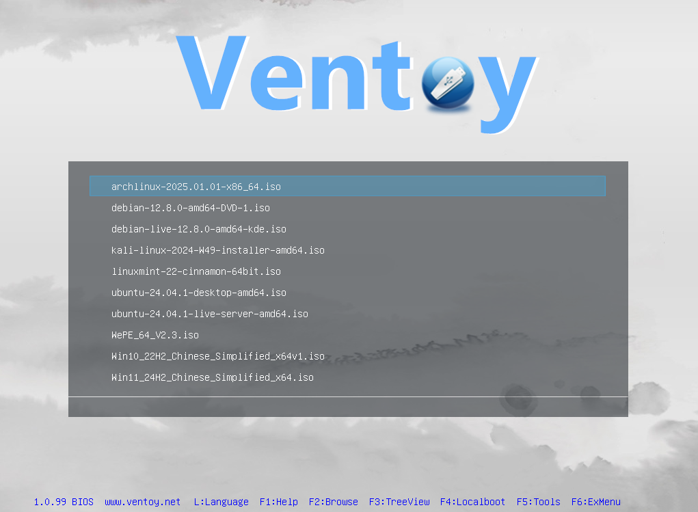
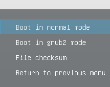
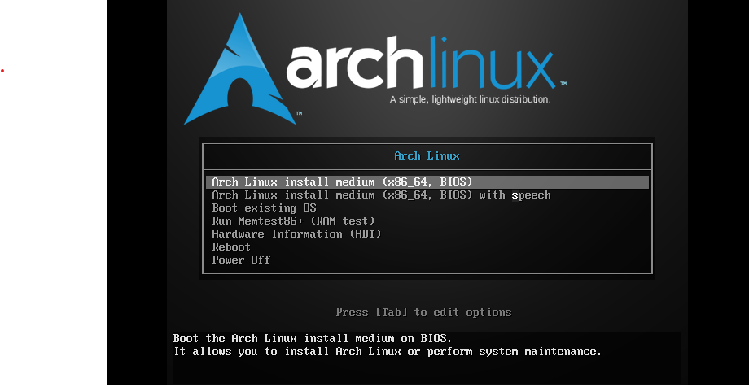
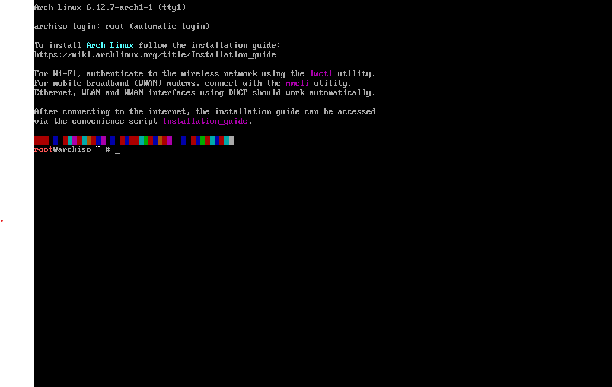
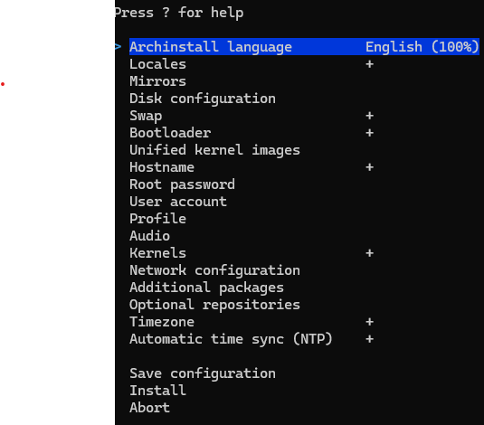
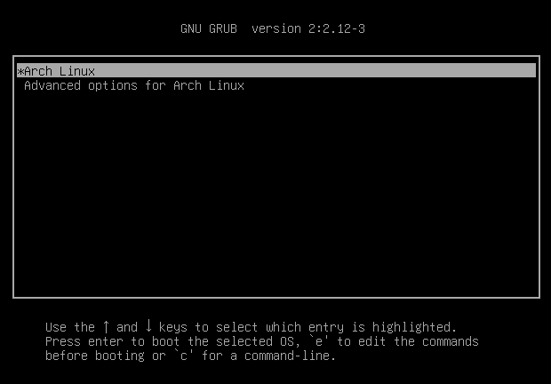

## 下载镜像并使用
- 使用以下链接从[清华大学开源镜像站](https://mirrors.tuna.tsinghua.edu.cn)站下载
https://mirrors.tuna.tsinghua.edu.cn/archlinux/iso/latest/archlinux-x86_64.iso

- 根据[我的另一个教程](https://pantomie.github.io/2025/01/19/Ventoy-install/)安装Ventoy之后，将下载的镜像移至安装了Ventoy的存储设备内

- 确保**已安装Ventoy的存储设备**与**将要安装Arch的存储设备**正常，重启电脑，在开机时狂按特定按键，进入BIOS或启动菜单，选择**已安装Ventoy的存储设备**启动。进入BIOS的按键因主板而异，部分主板开机时会提示
 - 一般为**F1,F5,F11,F12,Delete**。
 例如*MSI H610M BOMBER* 的BIOS按键为**Delete**，启动菜单为**F11**
 - 各种主板BIOS有所不同，不再赘述，自行搜索

*祝你好运*

- 如果一切顺利，你将能够来到这个界面

 - 使用**↑**，**↓**来选择镜像，按**回车**确认

 选择**archlinux-x86_64.iso**，回车
 
 选择**Boot in normal mode**，回车

## 正式开始安装Arch-Linux！

*你醒啦？你已经半只脚踏入Linux了，在这个状态暂时无法正常复制粘贴*
*相信眼疾手快的你能够暂时适应手输命令的。。。吧？*
*注意点，输错了可能会导致一些意想不到的麻烦*

- 此时，你应该能看到这样的界面，或是黑乎乎的非图形化界面


- 但是并不重要，只需要选择**第一个选项**回车就行
- 稍等片刻以后，你将会来到这个界面

*据瞎猜，至此，你已经超越了90%的人*

**若使用非有线网络连接，则还需要配置网络连接**

### 更改软件源为国内镜像源
```bash
echo "Server = https://mirrors.tuna.tsinghua.edu.cn/archlinux/\$repo/os/\$arch" > /etc/pacman.d/mirrorlist
```
```bash
pacman -Sy
```

若看到这样的输出，说明一切正常

### 进行安装
使用以下命令
```bash
archinstall
```
稍等片刻，你将看到这个界面

- **不要修改第一项与第二项，你也不想看到你的终端全是密密麻麻的小方块吧？**

- 选择Mirrors > Custom mirrors > 输入任意名称 > 输入https://mirrors.tuna.tsinghua.edu.cn/archlinux/$repo/os/$arch
 - 选择 Required > 选择 TrustAll
 - 选择 Confirm and exit（确认并退出）
 - 选择 Back
- 选择**Disk configuration** > Partitioning > Use a best-effort default partition layout
 - 选择**将要安装Arch的存储设备**
 - Filesystem一般选择**ext4**
 - *Would you like to create a separate partition for /home?*
是否创建一个分区挂载到/home
个人习惯选择NO
 - 选择Back


- 选择**Root password**（设置root密码）*别设置得复杂到自己都记不住*
 - 选择**User account** > Add a user > 输入一个自己想设置的用户名
 - 设置密码（为这个用户设置的，而非root密码）
 - Username: antom
  Password: \******
  Should "antom" be a superuser (sudo)?
 选择Yes
 - 选择**Confirm and exit**


- 选择**Network configuration**
 - 选择**Copy ISO network configuration to installation**


- 选择**Timezone**
 - 选择**Asia/Shanghai**

- **选择Install！**
 - **YES！**

---
*至此，你可以坐下来喝杯茶，等待安装*
当显示**Would you like to chroot into the newly created installation and perform post-installation configuration?**时，就说明**安装成功**了。

### 启动安装好的Arch
 - 选择NO
 - 使用以下命令重启
 ```bash
 reboot
 ```
**若重启后回到Ventoy，则重启进入BIOS修改启动设备**
若在重启后看到如下界面
***则说明你成功了！***

---

*下一篇教程：在Arch-Linux安装图形界面*
