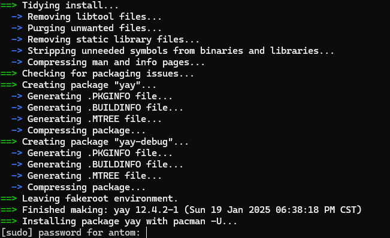

（仅记录过程未添加中文说明）

```bash
cd ~
sudo pacman -S base-devel git
git clone https://aur.archlinux.org/yay.git
cd yay
git config --global http.sslverify false
nano PKGBUILD
```
use**↓**

```
...
build() {
  export ...
  ...
  export GO111MODULE=on
  export GOPROXY=https://goproxy.cn
}
...
```
Ctrl+X
y
Enter


```bash
makepkg -si
```

Enter password(not root password)
```bash
yay -S paru
cd ..
rm -rf yay
```
